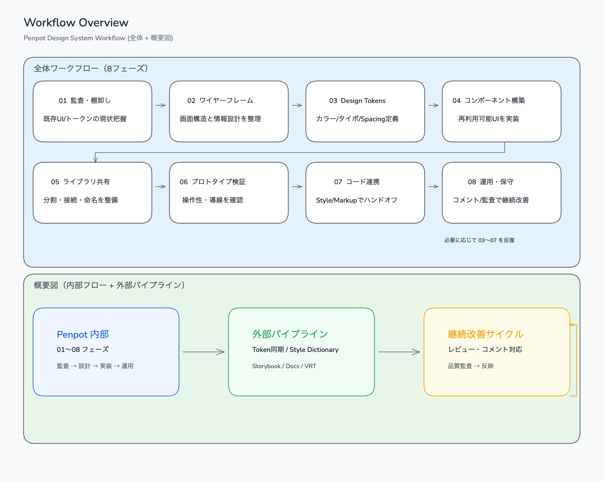
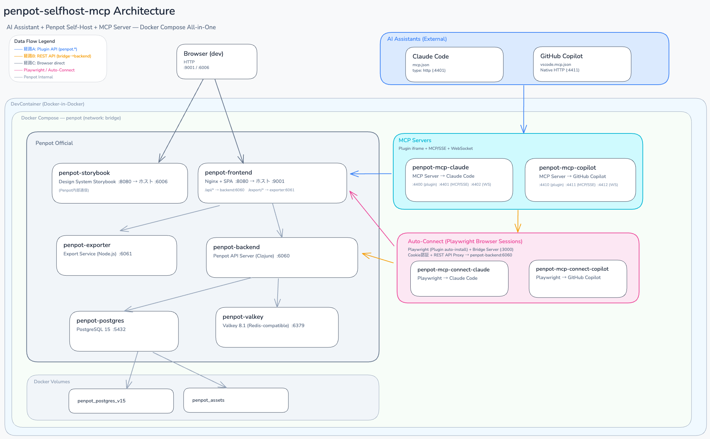

# penpot-selfhost-mcp

自然言語だけで [Penpot](https://penpot.app/) 上に UI デザインを作成・デザインシステムを構築する POC。
Penpot セルフホスト環境と MCP サーバーをオールインワンの Docker Compose で提供し、Claude Code / GitHub Copilot から操作できる。


## 準備

- [VS Code](https://code.visualstudio.com/)
- [Docker](https://www.docker.com/ja-jp/)（または [podman](https://podman.io/)。podman の場合は `dev.containers.dockerPath` を `podman` に設定）
- VS Code 拡張機能 [Dev Containers](https://marketplace.visualstudio.com/items?itemName=ms-vscode-remote.remote-containers)

> 動作確認環境: macOS + podman

## クイックスタート

1. リポジトリを VS Code で開き、コマンドパレット（`F1`）→ **Dev Containers: Reopen in Container** を選択
2. AI エージェントに「penpotで〜」と依頼すると、環境の起動から MCP 接続まで自動で行われる
3. 起動後 http://localhost:9001 にアクセス（デフォルト: `dev@example.com` / `devdev123`）

> コマンドパレット（`F1`）→ **Browser: Open Integrated Browser** で VS Code 内ブラウザが使える

### プロンプト例

> **penpotでTODOアプリケーションのプロトタイプをインタラクション付きで作成して**

> **penpotでレビューして結果をコメント登録して**

> **penpotでコメント確認し修正して。修正内容をコメントで返して**

> **penpotで作成したTODOアプリケーションのプロトタイプをもとに、アプリケーションを作成して**

> **penpotでデザインシステムを構築して**

> **penpotで既存のデザインを監査してトークンを抽出して**

> **penpotにユーザー追加して。test@example.com**

> **frontend-design で、todoアプリの画面デザイン案を３つ tmp/ 下に出力して**

> **penpotで frontend-design で作成されたデザインを元にプロトタイプを作成して**

手動で環境を管理する場合は [SKILL.md](.claude/skills/penpot/SKILL.md) を参照。

## 対応AIツール

| ツール                   | MCP設定ファイル    | 備考                                                                              |
| ------------------------ | ------------------ | --------------------------------------------------------------------------------- |
| Claude Code(CLI)         | `.mcp.json`        | Streamable HTTP で直接接続                                                        |
| GitHub Copilot (VS Code) | `.vscode/mcp.json` | ネイティブ HTTP 対応 → [利用ガイド](.claude/skills/penpot/docs/github-copilot.md) |

> Claude Code の [VS Code extension](https://code.claude.com/docs/en/vs-code#vs-code-extension-vs-claude-code-cli) を使う場合は `/penpot` でスキルを明示的に起動する必要がある。

## 仕組み — Agent Skills

このプロジェクトの中核は **[Agent Skills](https://agentskills.io/)**。
Agent Skills は AI エージェントに専門的な知識とワークフローを与えるための軽量なオープンフォーマットで、Claude Code、GitHub Copilot (VS Code)、Cursor など多くの AI ツールが対応している。

本リポジトリは Penpot セルフホスト環境（Docker Compose）、MCP サーバー、自動接続スクリプトといったインフラ一式を含むが、それらを束ねて AI エージェントに使わせているのが `.claude/skills/penpot/` に配置された **スキル定義**。スキルがドメイン知識・手順・スクリプトをパッケージ化し、AI エージェントの振る舞いを決定する。

```
.claude/skills/penpot/
├── SKILL.md              # スキル定義（エントリーポイント）
├── reference/            # ナレッジベース（デザイン・API・環境・ワークフロー・パイプライン）
├── docs/                 # 利用ガイド
└── scripts/              # 実行スクリプト（Docker 環境管理・デザインユーティリティ）
```

ユーザーが「**penpotで〜**」と話しかけると、以下が自動的に行われる:

1. **スキル起動** — `SKILL.md` がロードされ、AI エージェントにドメイン知識と手順が注入される
2. **環境構築** — Docker Compose で Penpot + MCP サーバーを起動
3. **MCP 接続** — Playwright による自動ブラウザ操作で Penpot Plugin 経由の MCP 接続を確立
4. **デザイン作成** — MCP 経由の Plugin API でシェイプ・レイアウト・インタラクションを構築
5. **検証** — デザイン制約の自動チェックとビジュアル確認

デザインシステムの構築では、さらに以下のフェーズを段階的に進める:

1. **監査・棚卸し** — 既存 UI の色・フォント・余白を収集し重複・不整合を可視化
2. **Design Tokens 定義** — カラー・タイポグラフィ・スペーシングをトークンとしてライブラリに登録
3. **コンポーネント構築** — ボタン・フォーム・カードなどをバリアント付きで設計
4. **ライブラリ分割・共有** — トークンとコンポーネントを独立ライブラリに分割し依存関係を設定
5. **運用・メンテナンス** — 定期監査とバージョニングで品質を維持

スキルが AI エージェントの「手順書」として機能し、**インフラ構築からデザイン作成までをエンドツーエンドで自律実行する**仕組みになっている。



## アーキテクチャ




MCP サーバーは [Penpot 公式リポジトリ](https://github.com/penpot/penpot/tree/develop/mcp) の `mcp/` ディレクトリからソースをビルドしている。
詳細は [SKILL.md](.claude/skills/penpot/SKILL.md) を参照。

## Design References

### Penpot

- [Penpot Documentation](https://help.penpot.app/) — Penpot 公式ドキュメント
  - [Penpot User Guide](https://help.penpot.app/user-guide/) - ユーザーガイド
  - [Technical Guide](https://help.penpot.app/technical-guide/) - テクニカルガイド
- [Design Tokens with Penpot](https://penpot.app/blog/design-tokens-with-penpot/) — Penpot 公式トークンチュートリアル
- [The developer's guide to design tokens and CSS variables](https://penpot.app/blog/the-developers-guide-to-design-tokens-and-css-variables/) — トークンと CSS 変数の関係
- [Penpot Community](https://community.penpot.app/) — Penpot コミュニティフォーラム

### 一般リソース

- [Creating a Penpot Design Tokens Format with Style Dictionary](https://www.alwaystwisted.com/articles/a-design-tokens-workflow-part-12) — Style Dictionary と Penpot の連携ガイド
- [Style Dictionary](https://github.com/amzn/style-dictionary) — トークン変換ツール
- [W3C Design Tokens Community Group](https://www.designtokens.org/) — トークン標準仕様
- [Astro Starlight](https://starlight.astro.build/) — ドキュメントサイトテーマ（将来予定）
- [Lost Pixel](https://github.com/lost-pixel/lost-pixel) — ビジュアルリグレッションテスト（将来予定）

## License

MIT
